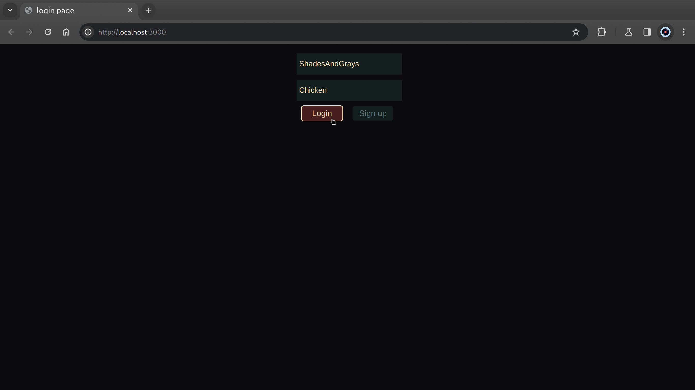

# Login Page
Welcome to my login page :)  
It was made using html, css and js for the front end and Rust using Rocket for the backend. The Database was mysql and the ORM was diesel and simple migrations managed by diesel cli.





#  Usage
  
 
### Frontend

simply open the index.html file in the browser


### Backend

Open a new terminal and run the command 
``` cargo run ```  

This will start the server by default at port 8000

### Database

Diesel was used to run the database migrations. ```Diesel setup``` to set up the entire database

Alternatively, To setup the database manually.Open the msyql shell and and run the following
```mysql
CREATE DATABASE testLoginDB;
```
```mysql
USE testLoginDB;
```

```mysql
CREATE TABLE user (
    name VARCHAR(45) not null,
    password VARCHAR(45) not null,
    PRIMARY KEY(name)
); 

```
This creates a new database called **testLoginDB**. After creates a table called **user** with columns *username* and *password*


## Dependences

#### Rust Crates
- diesel 2.1.5
- dotenv 0.15.0
- rocket 0.5.0
- rocket_cors 0.6.0

